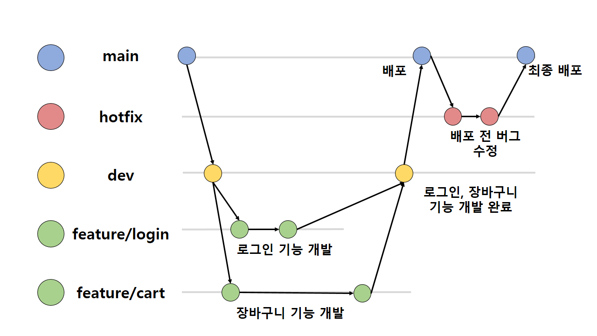

# 🔖 목차
> ## ✨[프로젝트 소개](#-프로젝트-소개)
>
> ## 👥[팀원 소개](#-팀원-소개-및-역할-분담)
>
> ## 🤝[협업 및 프로젝트 진행 상황 관리 방식](#-협업-및-프로젝트-진행-상황-관리-방식)
>
> ## 🔍[브랜치 전략](#-브랜치-전략)
>
> ## ✔[컨벤션](#-컨벤션)

## ✨ 프로젝트 소개

<h1>오르는 즐거움! 끌락끌락</h1>

<pre background-color="#dbdbdb">
- 클라이밍을 취미로 즐길 수 있는 앱
- 클라이밍 종목 유형 중 볼더링 종목에 초점을 맞추어 서비스 구현
- 자신의 클라이밍 영상을 촬영하여 SNS 에 업로드 하여 기록하는 클라이밍족의 문화에 착안하여, 송진가루를 손에 묻혀 진행하는 점에서 본인의 휴대전화가 더럽혀질 수 있다는 점을 기반으로 모션 인식을 통한 기록 자동화, 윙스펜 AI 기술을 활용한 팔길이 측정, 클라이밍장 3D 모델링 기술 등을 해당 앱에 녹여냈습니다.
</pre>

## 👥 팀원 소개 및 역할 분담

<table >
    <thead>
        <tr>
            <th align="center">도경록(팀장) - FE</th>
            <th align="center">김한민 - FE</th>
            <th align="center">도경원 - FE</th>
        </tr>
    </thead>
    <tbody>
        <td align="center">
            
        </td>
        <td align="center">
            
        </td>
        <td align="center">
            
        </td>
    </tbody>
</table>
<table >
    <thead>
        <tr>
            <th align="center">송동현 - BE</th>
            <th align="center">이지연 - BE</th>
            <th align="center">정영한 - BE</th>
        </tr>
    </thead>
    <tbody>
        <td align="center">
            
        </td>
        <td align="center">
            
        </td>
        <td align="center">
            
        </td>
    </tbody>
</table>

해당 프로필 사진을 클릭하면 해당 팀원의 깃허브로 이동합니다.

## 🤝 협업 및 프로젝트 진행 상황 관리 방식

    

    

 
<pre>
매일 스크럼 회의를 진행하며, Jira를 통한 1주 단위의 스프린트를 진행해서 팀원들의 각자 업무 분담 및 현황 파악을 용이하게 하는 동시에 스프린트 종료 시 회고하는 시간을 가졌습니다.
</pre>
 

    

 
<pre>
프로젝트를 진행하면서 필요한 명세서 및 기록들을 Notion 탬플릿을 활용하여 공유하였습니다.
</pre>
Notion 이미지 클릭시 해당 노션 페이지로 이동합니다.

## 🔍 브랜치 전략

<h1>Git Flow</h1>

## ✔ 컨벤션

팀원 간의 원활한 소통과 협업을 위해 커밋 컨벤션과, 코드 컨벤션을 만들어 이를 따랐습니다.

<h3>
<a href="">📍 커밋 컨벤션</a>
</h3>

<pre background-color="#dbdbdb">

🧾 1. 커밋 유형 지정
    - 커밋 유형은 영어 대문자로 작성하기
    - 커밋 유형
    - Feat : 새로운 기능 추가
    - Fix : 버그 수정
    - Docs : 문서 수정
    - Style : 코드 formatting, 세미콜론 누락, 코드 자체의 변경이 없는 경우
    - Refactor : 코드 리팩토링
    - Test : 테스트 코드, 리팩토링 테스트 코드 추가
    - Chore : 패키지 매니저 수정, 그 외 기타 수정 ex) .gitignore
    - Design : CSS 등 사용자 UI 디자인 변경
    - Comment : 필요한 주석 추가 및 변경
    - Init: 프로젝트 초기 생성
    - Rename : 파일 또는 폴더 명을 수정하거나 옮기는 작업만인 경우
    - Remove : 파일을 삭제하는 작업만 수행한 경우
    - !BREAKING CHANGE : 커다란 API 변경의 경우
    - !HOTFIX : 급하게 치명적인 버그를 고쳐야 하는 경우

🧾 2. 제목과 본문을 빈행으로 분리 - 커밋 유형 이후 제목과 본문은 한글로 작성하여 내용이 잘 전달될 수 있도록 할 것 - 본문에는 변경한 내용과 이유 설명 (어떻게보다는 무엇 & 왜를 설명)

#️⃣ 3. 제목 첫 글자는 대문자로, 끝에는 . 금지

↩️ 4. 제목은 영문 기준 50자 이내로 할 것

⏺️ 5. 자신의 코드가 직관적으로 바로 파악할 수 있다고 생각하지 말자

👆 6. 여러가지 항목이 있다면 글머리 기호를 통해 가독성 높이기

</pre>

<h3>
<a href="">📍 코드 컨벤션</a>
</h3>

<pre>

🛼 문자열을 처리할 때는 쌍따옴표를 사용하도록 합니다.

🐫 문장이 종료될 때는 세미콜론을 붙여줍니다.

💄 함수명, 변수명은 카멜케이스로 작성합니다.

🐫 가독성을 위해 한 줄에 하나의 문장만 작성합니다.

❓ 주석은 설명하려는 구문에 맞춰 들여쓰기 합니다.

🔠 연산자 사이에는 공백을 추가하여 가독성을 높입니다.

🔢 콤마 다음에 값이 올 경우 공백을 추가하여 가독성을 높입니다.

💬 생성자 함수명의 맨 앞글자는 대문자로 합니다.

🔚 var는 절대 사용하지 않는다. (const를 let 보다 위에 선언한다)

👆 const와 let은 사용 시점에 선언 및 할당을 한다. (함수는 변수 선언문 다음에 오도록한다.)

✏️ 외부 모듈과 내부 모듈을 구분하여 사용한다.

🧮 배열과 객체는 반드시 리터럴로 선언한다. (new 사용 X)

📠 배열 복사 시 반복문을 사용하지 않는다.

😎 배열의 시작 괄호 안에 요소가 줄 바꿈으로 시작되었다면 끝 괄호 이전에도 일관된 줄 바꿈 해야한다. (일관되게 모두 줄 바꿈을 해주어야 한다.)

🧶 객체의 프로퍼티가 1개인 경우에만 한 줄 정의를 허용하며, 2개 이상일 경우에는 개행을 강제한다. (객체 리터럴 정의 시 콜론 앞은 공백을 허용하지 않음 콜론 뒤는 항상 공백을 강제)

🧂 메서드 문법 사용 시 메서드 사이에 개행을 추가한다.

🌭 화살표 함수의 파라미터가 하나이면 괄호를 생략한다.

🍳 변수 등을 조합해서 문자열을 생성하는 경우 템플릿 문자열을 이용한다.

🧇 변수 등을 조합해서 문자열을 생성하는 경우 템플릿 문자열을 이용한다.

🥞 wildcard import는 사용하지 않는다. (import문으로부터 직접 export하지 않는다.)

🥖 한 줄짜리 블록일 경우라도 {}를 생략하지 않으며 명확히 줄 바꿈 하여 사용한다.

🥯 switch-case 사용 시 첫 번째 case문을 제외하고 case문 사용 이전에 개행한다.

🥐 삼중 등호 연산자인 ===, !==만 사용한다.

🚐 반복문 사용은 일반화된 순회 메서드 사용을 권장한다.