# 시연 시나리오

## 시나리오 (only)

### 로그인은 시간 관계상 생략
- test01@naver.com으로 시연

### 2. HOME (켈린더)
- 끌락이 횟수별 차이 보이게 보여주기
- 일자별 상세는 나중에 
- **1~2달 정도 뒤까지 보여주면서 이전 기록들 잘 들어갔는지 보여주기**

### 3. MyPage

#### 3.1 티어 및 정보 보여주기 
- 티어 및 정보는 간단하게 보여주기

#### 3.2 윙스팬 측정
- 윙스팬은 실제 팀원과 시연

### 4. 클라이밍장 조회
- **웨이브락 클라이밍 남천점**으로 미리 **GPS 설정**해놓기
- 해당 클라이밍장 들어가서 상세 정보 보여주기
- 클라이밍장 들어가서 3D 모델링 보여주기

### 5. 챌린지
- push 알림 뜨는거 보여주기
- 해금 버튼 클릭해서 해금
- 해금한 클라이밍장 페이지 상세보기 들어가서 확인

### 6. 영상 촬영

#### 6.1 촬영전 미리 찍은 영상 먼저 보여주기

#### 6.2 실제 시연

### 7. 앨범 캘린더
- 방금 촬영한 영상 잘 들어갔는지 보여주기

### 8. 캘린더 상세보기
- 캘린더 상세 현재일꺼 보여주기

### 9. 통계 
- 주-월-년으로 넘어가면서 잘 정리된거 보여주기
- 장소눌러서 젤 위에꺼 누르기 

## 시나리오 (with 스크린샸)

### 1. 로그인

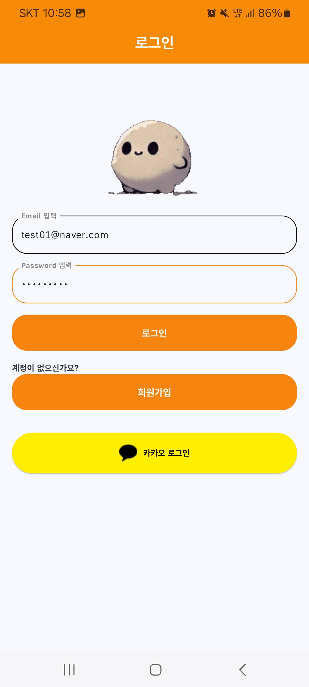

### 2. HOME (켈린더)

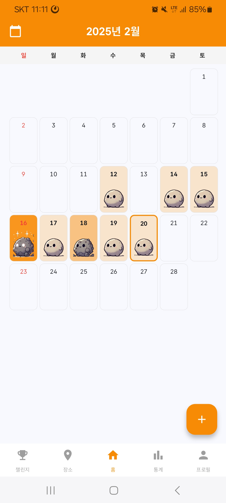

### 3. MyPage

#### 3.1 티어 및 정보 보여주기 

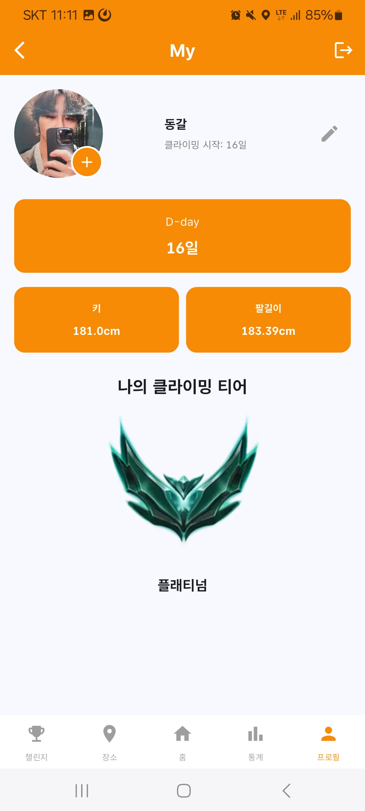

#### 3.2 윙스팬 측정

### 4. 클라이밍장 조회

    
    

### 5. 챌린지
- push 알림 뜨는거 보여주기

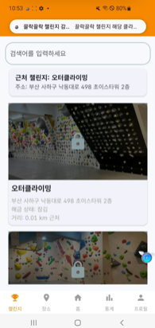

- 해금 버튼 클릭해서 해금
- 해금한 클라이밍장 페이지 상세보기 들어가서 확인

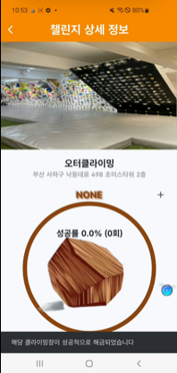

### 6. 영상 촬영

#### 6.1 촬영전 미리 찍은 영상 먼저 보여주기

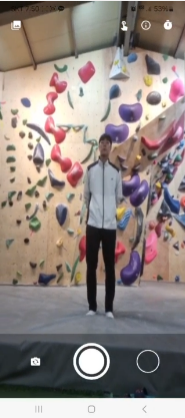

#### 6.2 실제 시연
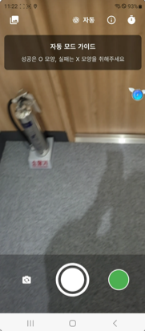

### 7. 앨범 캘린더
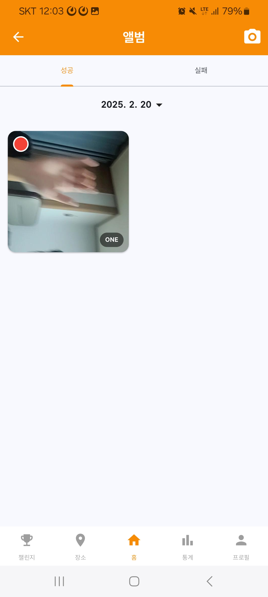

### 8. 캘린더 상세보기
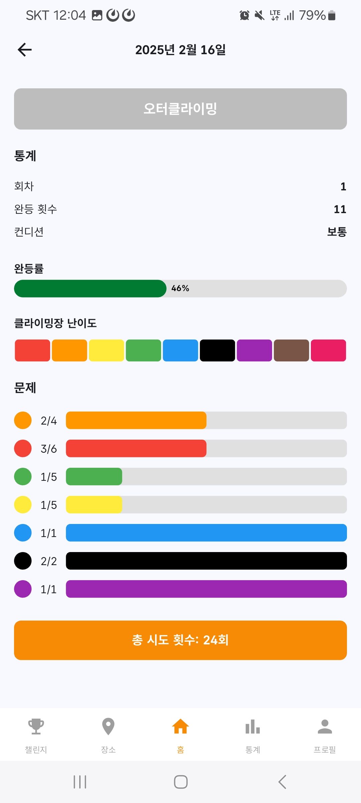

### 9. 통계 

    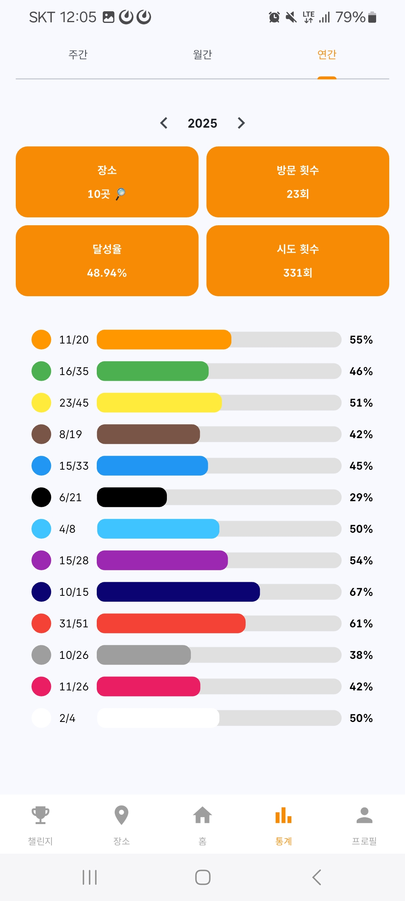
    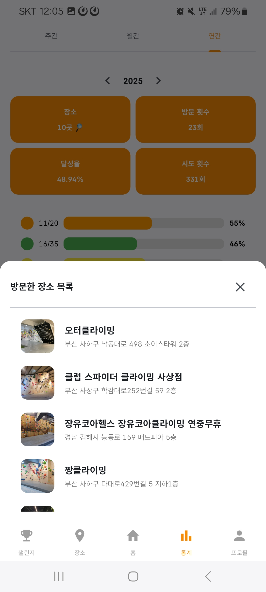
    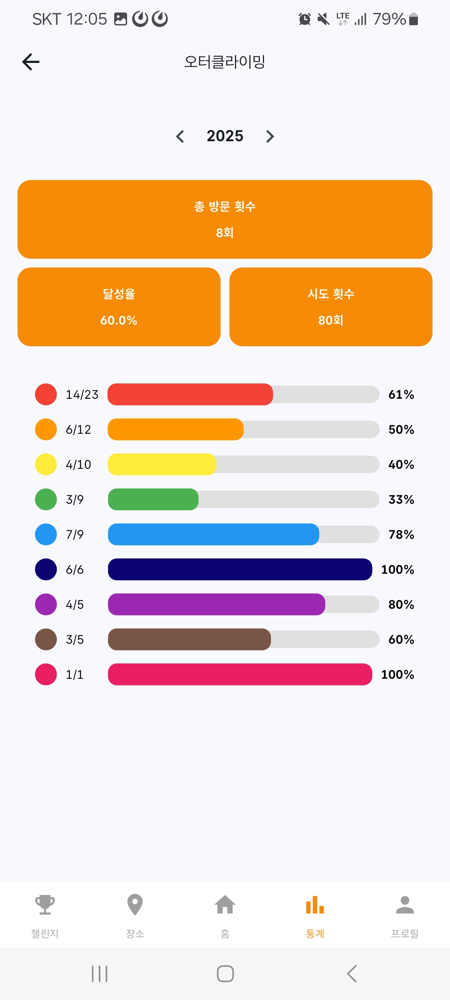

