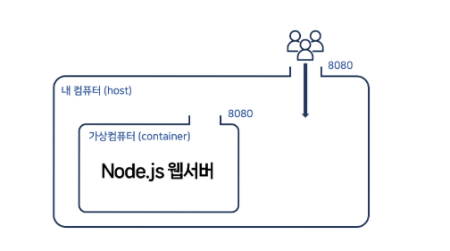
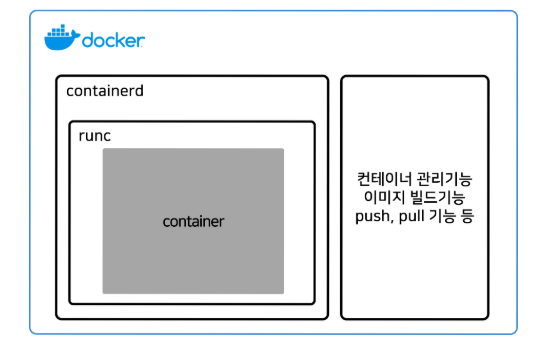

# 5장 컨테이너 다루기

docker desktop 안에서는 모든 기능을 쓸 수 있는 것이 아님
따라서 터미널에서 명령어를 쓰는 경우가 더 많다

### 이미지 실행 터미널에서 실행
도커 터미널에 명령어 입력

```
docker run -d 이미지명:태그명
```
**이렇게 할시 터미널 하나를 무단 점유하기 때문에 터미널이 또 필요해지면 터미널을 하나 더 열어야함**
- -d 옵션을 넣어서 백그라운드에서 실행가능 하도록 하면 해결됨 (detached)


### 이미지 실행시 포트 설정
이미지 실행시 포트를 설정해주고 싶으면 -p를 넣고 **내컴퓨터포트:컨테이너포트**를 집어넣으면 됨

```
docker run -p 8080:8000 -d 이미지명:태그명
```
- 내 컴퓨터 8080포트로 들어오면 컨테이너의 8080포트로 안내해주라는 뜻
- 포트설정 없이 그냥 띄우면 브라우저 접속시 아무것도 뜨지않는다

#### 포트 설정을 하는 이유


localhost는 내 컴퓨터에 접속하라는 뜻이고 8080은 8080번 포트로 접속하라는 뜻이다.
그렇지만 거기로 들어가면 웹서버는 없다
왜냐하면 웹서버는 **내 컴퓨터 안의 가상컴퓨터**에서 돌아가고 있기때문
따라서 내 컴퓨터 & 가상컴퓨터의 포트끼리 연결하는 작업을 해주면 된다.

### 컨테이너 관련한 명령어

#### 현재 실행중인 컨테이너 확인
```
docker ps
```

#### 컨테이너 컴퓨터 터미널의 로그 출력이 가능
```
docker logs
```

#### 특정 컨테이너 접속
```
docker exec -it 컨테이너이름 sh
```
- 명령어 입력할 때 마다 그 컨테이너 터미널 안에서 실행이 됨
- 진짠지 궁금하면 들어가서 파일 목록 보여주는 ls 명령어 입력
- 컨테이너를 탈출하려면 ctrl + p 후에 ctrl + q 입력


#### 실행중인 컨테이너 정지
- 컨테이너 아이디를 입력해도 가능

#### 정지된 컨테이너 삭제
- 정지안된 컨테이너 삭제시 -f 옵션을 붙이기기
```
docker rm 컨테이너이름
```

### 컨테이너 구조
- 리눅스 OS가 제공하는 기능들을 섞은 것
- 리눅스의 namespace 기능을 사용하면 프로그램마다 서로 영향을 끼치지 않게 독립적으로 프로세스와 파일구조 같은걸 분리해줄 수 있음
- 리눅스의 cgroup 기능을 사용하면 프로그램마다 CPU나 램을 얼마나 점유할 건지도 정해줄 수 있음
- 이런걸 이용하면 혼자 별도로 독립적으로 동작하는 가상 컴퓨터를 만들 수 있는데 이걸 "컨테이너"라고 멋있게 포장해서 부를 뿐

#### 컨테이너 장점
- 컨테이너는 여러 개를 띄울 수 있어서 컴퓨터 한 대에서 여러 컴퓨터를 운영하는 것 처럼 마법을 부릴 수 있음
- 컨테이너에서 문제가 생겨도 내 컴퓨터로 전염되는 일이 거의 없다




- 원래 runc같은 프로그램을 쓰면 컨테이너를 띄울 수 있음.
- 실은 containerd라는 프로그램으로 runc를 조작하면 편리하기도 함
- Docker는 containerd, runc를 7살짜리도 쓸 수 있게 만든 프로그램
    - 이미지 빌드가능, pull 기능, 관리기능 이런걸 더해서 개발자들 편하게 만들어준 것

- 때문에 Podman, 맥북의 경우 Orbstack 이런게 최근 가볍다고 유행하기도 함


# 6장 성능을 위한 Dockerfile 작성법
- 나만의 이미지를 만들고 싶으면 Dockerfile에다가 레시피를 작성하면 됨
- docker build 시간 단축, 용량절약, 보안향상을 위한 매직 레시피 같은게 있음

### 좋은 관습 1. 캐싱
- 프로젝트가 커지면 docker build 입력해서 기다리는 시간도 싫음 (배포할 때마다 docker build입력하기 싫음)

#### 해결방안
- Dockerfile 작성시 "빌드할 때마다 변동사항이 많이 생기는 부분들을 최대한 아래 쪽에 적기" 입니다.

- 원래 빌드 작업시, COPY, RUN 명령어 실행할 때 마다 도커가 몰래 캐시을 해놓음
- 캐싱은 결과를 몰래 저장해놓고 나중에 필요해지면 재사용한다는 소리
    - 캐싱된 명령어들을 매웅 빠르게 처리
    - 변동사항이 생긴 명령어부터는 캐싱된걸 사용하지 않음


예를 들면 Node.js로 웹서버 개발하는 경우는
package.json 내용이나 npm install로 라이브러리 설치하는건 날마다 변동사항이 거의 없다.
(라이브러리를 매일매일 설치하진 않으니까)

그래서
1. OS와 Node.js 설치하고
2. package.json 먼저 옮겨서 라이브러리 설치부터 먼저 하고
3. 그 다음에 자주 변동되는 소스코드 옮기고
...
그런 식으로 Dockerfile을 작성하면 매번 docker build 할 때 약간이라도 더 빨라질 수 있음

결과과
```
(Dockerfile)

FROM node:20-slim
WORKDIR /app
COPY package*.json .
RUN ["npm", "install"]

COPY . .
EXPOSE 8080
CMD ["node", "server.js"]
```

### 좋은 관습2. npm ci
- Node.js의 경우 라이브러리를 정확한 버전을 설치하려면 npm install 말고 npm ci를 쓰는 것이 좋음
- package-lock.json에 내가 쓰는 라이브러리의 정확한 버전이 써있기 때문에 그걸 바탕으로 설치하라고 입력하는게 npm ci 

### 좋은 관습3. ENV
```
(Dockerfile)

ENV NODE_ENV=production
CMD 어쩌구~
```

- ENV 라는 명령어를 쓰면 환경변수를 집어넣어서 이미지를 빌드할 수 있음. 
- ENV 환경변수이름=값 사용하면 됨.

- docker run할 떄도 -e 옵션을 환경변수를 그때그때 집어넣어서 이미지를 생성할 수 있음


### 좋은 관습4. 자세 낮추기
보안적으로 더 나은 습관도 있는데 원래 Dockerfile에 적은 명령어들은 전부 root 권한으로 실행.
마지막에 서버 띄우는 명령어는 root 말고 권한을 좀 낮춰서 실행하는게 약간 더 안전하고 좋음.

유저를 하나 생성하고 그걸로 유저를 바꿔서 실행하라고 코드짜면 됨
https://github.com/nodejs/docker-node/blob/main/docs/BestPractices.md

```
(Dockerfile)

USER node
CMD 어쩌구~
```

### Spring boot 프로젝트의 경우

Spring boot 서버를 실행하려면
1. 터미널에서 ./gradlew build 입력해서 .jar파일을 만들고
2. 터미널에서 java -jar .jar파일경로 입력해서 .jar 파일 실행하면 끝
매우 간단한 편이라 Dockerfile도 저렇게 작성하면 이미지 생성 끝.

```
FROM amazoncorretto:21.0.4
WORKDIR /app
COPY . .
RUN ./gradlew build
CMD ["java", "-jar", ".jar파일경로"] 
```

프로젝트 폴더에 Dockerfile 만들고 이런거 작성하는게 끝입니다.
- 아마 .jar 파일은 /build/libs 폴더에 생성됨

용량을 줄이고 싶으면 .jar 파일 하나만 담은 이미지를 생성해서 그것만 실행하라고 Dockerfile을 작성하면 이미지 용량을 훨씬 작게 만들수 있음(jar 파일만 있으면 서버 돌릴 수 있음)

1. 터미널에 ./gradlew build를 입력해서 .jar파일을 만들기
2. 새로운 이미지를 만들어서 그 .jar 파일을 새로운 이미지로 옮기기
3. 명령어로 .jar 파일을 실행하기
이렇게 작성하면 되는 것임

### multi-stage build
```
FROM amazoncorretto:21.0.4 AS build
WORKDIR /app
COPY . .
RUN ./gradlew build

# Runtime stage
FROM amazoncorretto:21.0.4 AS runtime
WORKDIR /app
COPY --from=build /app/build/libs/*.jar /app/server.jar
CMD ["java", "-jar", "/app/server.jar"] 
```

Dockerfile에 FROM을 2번 이상 작성할 수 있음
- FROM을 만날 때 마다 위에 있는 작업내역들이 삭제되고 새로운 마음으로 깨끗하게 시작된다.
- 근데 깨끗하게 시작할 때 위의 작업내역에서 만든 파일들을 **몰래 훔쳐올 수 있다.**

첫째 FROM에선 /app 폴더에서 .jar 파일만 만들어줌
두번째 FROM에선 이전 FROM에서 나온 .jar 파일을 /app/server.jar 경로로 훔쳐오라고 했습니다.
--from=build 이러면 build라고 이름지은 곳에 있던 파일을 카피하라는 뜻.
(AS 명령어 쓰면 FROM마다 이름을 마음대로 붙일 수 있다.)
그 다음에 마지막에 .jar 파일을 실행!!

그럼 이제 최종 이미지에는 .jar 파일, 리눅스OS, 자바21 JDK 이 정도만 들어있어서 좀 가벼워짐.
FROM 여러번 쓰는 것을 **multi-stage build** 라고 하는데
그래서 빌드과정이 필요한 프로젝트들은 이런 식으로 작성해서 용량을 줄이고 보안도 약간 챙길 수 있다.

### bootBuildImage 명령
Spring boot에서 gradle을 쓰는 경우에는 이미지 만드는 명령어가 아마 내장되어있습니다.
터미널에 ./gradlew bootBuildImage 입력하면 이미지를 자동으로 만들어주기 때문에
Dockerfile 작성귀찮으면 한 번 사용해도 된다다.