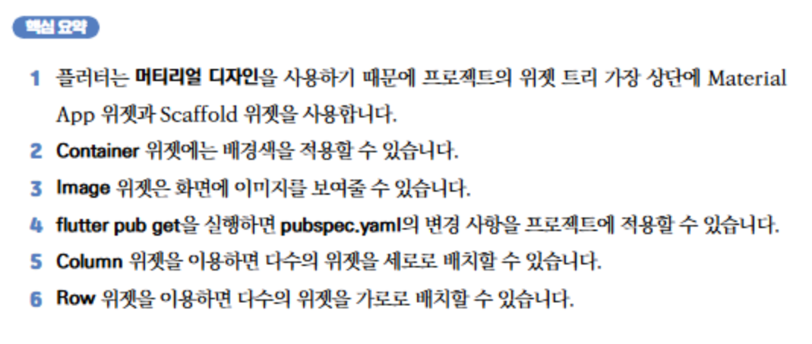

## **Splash Screen App - 주요 코드 설명**

```dart
Widget build(BuildContext context) {
    return MaterialApp(
      home: Scaffold(
        body: Container(
            decoration: BoxDecoration(
              color: Color(0xFFF99231),
            ),
            child: Row(
              mainAxisAlignment: MainAxisAlignment.center,
              children: [
                Column(
                  mainAxisAlignment: MainAxisAlignment.center,
                  children: [
                    Image.asset(
                      'assets/logo.png',
                      width: 200,
                    ),
                    CircularProgressIndicator(
                      valueColor: AlwaysStoppedAnimation(
                        Colors.white,
                      ),
                    ),
                  ],
                ),
              ],
            )
          ),
        ),
    );
  }
```

---

### **코드 설명**

#### 1. `MaterialApp`
- Flutter 애플리케이션의 루트 위젯입니다.
- `Material Design` 스타일을 앱에 적용하고, 주요 화면을 설정합니다.
- 여기서 `home` 속성에 스플래시 스크린 화면을 연결했습니다.

#### 2. `Scaffold`
- Flutter 앱의 기본 구조를 제공합니다.
- `body` 속성을 사용해 스플래시 화면의 주요 UI를 설정합니다.

#### 3. `Container`
- 화면의 배경 스타일을 설정하는 데 사용됩니다.
- 여기서는 **`BoxDecoration`**을 통해 배경색을 주황색(`Color(0xFFF99231)`)으로 지정했습니다.

#### 4. `BoxDecoration`
- **`Container`의 스타일 속성**입니다.
- 이 코드에서는 **배경색(background color)**만 설정했지만, 테두리(border), 그림자(shadow) 등도 추가할 수 있습니다.

#### 5. `Center`
- 화면 중앙에 자식을 배치하는 위젯입니다.
- 여기서는 **이미지(`Image.asset`)**와 로딩 애니메이션(`CircularProgressIndicator`)을 화면 중앙에 배치하기 위해 사용되었습니다.

#### 6. `Image.asset`
- 앱의 로컬 디렉터리에 저장된 이미지를 표시합니다.
- `'assets/logo.png'` 경로의 이미지를 로드하여 스플래시 화면의 중심에 표시합니다.
- **이미지 파일 경로**는 `pubspec.yaml` 파일에 등록해야 정상적으로 동작합니다.


#### 7. `Row`
- 가로로 자식을 배치하는 Flutter 위젯입니다.
- 이 코드에서는 `mainAxisAlignment: MainAxisAlignment.center` 속성을 사용하여, 자식 위젯들을 가로로 중앙에 정렬했습니다.
- `Row` 위젯은 `Column` 위젯을 감싸고 있으며, 자식들을 정렬할 때 유연한 배치를 제공합니다.

#### 8. `Column`
- 세로로 자식을 배치하는 Flutter 위젯입니다.
- `mainAxisAlignment: MainAxisAlignment.center` 속성을 사용하여 모든 내용을 세로 중앙에 정렬했습니다.
- 이 `Column` 위젯 안에는 앱 로고(`Image.asset`)와 로딩 애니메이션(`CircularProgressIndicator`)이 포함되어 있습니다.

#### 9. `CircularProgressIndicator`
- Flutter에서 기본 제공하는 로딩 애니메이션 위젯입니다.
- `valueColor` 속성을 사용해 로딩 애니메이션의 색상을 **흰색**으로 설정했습니다.
- `AlwaysStoppedAnimation`을 사용하여 고정된 색상으로 애니메이션을 표시하도록 설정했습니다.
- 이는 사용자가 앱이 로드 중임을 알 수 있도록 합니다.

---

