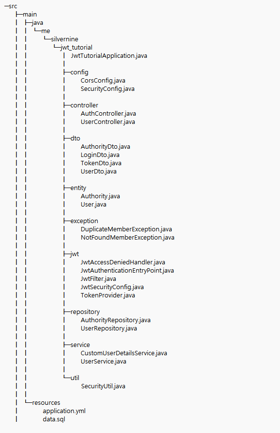
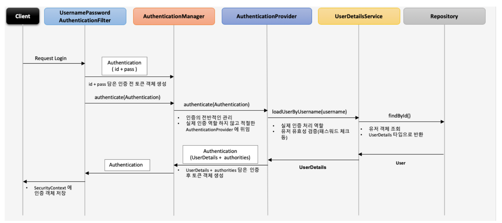
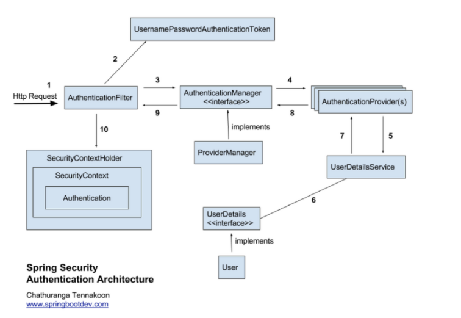

# JWT 구현

## 프로젝트 구조


### jwt
TokenProvider : 토큰의 생성, 유효성 검증을 담당
     - InitializingBean을 implements 한 후 afterPropertiesSet을 Override : 빈 생성후 의존성 주입을 받은 후 sercret값을 Base64 Decode 해서 key 변수에 할당\
    - createToken 메서드 
        - 파라미터 : Authentication 객체
        - 권한과, 만료시간을 설정하고 token을 생성

    - getAuthentication 메서드 : Jwt 토큰을 파라미터로 받고 토큰 안에 권한 정보를 이용해서 Authentication 객체를 리턴하는 메서드
        - UsernamePasswordAuthenticationToken 객체 반환 (SecurityContextHolder에 저장되고 요청 처리중 인증 정보를 참조할 수 있음)

    - validateToken : 토큰의 유효성 검증을 수행하는 validateToken 메소드

### controller
UserController
    - singup메서드 : UserDto를 파라미터로 받아서 UserService의 singup 메서드 호출
    - getMyUserInfo : @PreAuthorize를 통해 USER, ADMIN 두가지 권한 모두 허용
    - getUserInfo : ADMIN 권한만 호출, UserService에서 만들었던 username 파라미터를 기준으로 유저 정보와 권한 정보를 리턴


### service
UserService : 회원가입, 유저정보 조회 메서드 있음
    - UserRepository, PasswordEncoder을 주입받음
    - 유저 정보가 DB에 없으면 Authority와 User 정보를 생성해 UserRepository save 메서드를 통해 DB에 저장
    - getUserWithAuthorities는 username을 기준으로 정보를 가져옴
    - getMyUserWithAuthorities는 SecurityContext에 저장된 username의 정보만 가져온다

 
### util
**SecurityUtil.java** 
getCurrentUsername 메서드 : Security Context의 Authentication 객체를 이용해 username을 리턴해주는 간단한 유틸성 메소드
    - Security Context에 Authentication객체가 저장되는 시점은 JwtFilter의 doFilter메서드에서 Request가 들어올 때 SecurityContext에 Authentication객체를 저장해서 사용




## Spring Security Architecture와 함께 보는 인증 처리 과정



1. 사용자 로그인 정보와 함께 인증 요청을 한다.

2. AuthenticationFilter가 요청을 가로채서 UsernamePasswordAuthenticationToken의 인증용 객체를 생성

**UsernamePasswordAuthenticationToken**

- UsernamePasswordAuthenticationToken은 Authentication을 extends 한 AbstractAuthenticationToken의 하위 클래스
-  User의 Id가 Principal 역할을 하고, Password가 Credential의 역할을 함
- UsernamePasswordAuthenticationToken의 첫 번째 생성자는 인증 전의 객체를 생성하고, 두 번째 생성자는 인증이 완료된 객체를 생성합니다.


3. AuthenticationManagerBuilder에게 authenticationToken 객체를 전달

**AuthenticationManagerBuilder**
- 인증 관련 설정을 구성하기 위해 Spring Sucurity에서 사용되는 도구 중 하나
- AuthenticationManagerBuilder는 따로 설정 해주지 않아도 애플리케이션 구동시 Spring의 auth-configuration을 통해 자동으로 DI가 됨
- authenticationManagerBuilder.getObject() 메서드를 통해 AuthenticationManager로 실제 인증을 수행

4. authenticate()를 통해 AuthenticationManager는 등록되 AuthenticationProvider을 조회하여 인증을 요구함

5. AuthenticationProvider은 사용자의 아이디를 UserDetailService에 보냄.

6. loadUserByUsername()에서 사용자의 아이디를 DB에 조회하면서 사용자 정보를 조회하고 조회한 객체를 AuthenticationProvider에 전달하고 Authentication 객체(User,authorities)를 생성

7. 생성한 Authentication 객체를 SecurityContext/SecurityContext에 저장

8. tokenProvider.createToken()에 Authentication 객체를 파라미터로 전달해 jwt 토큰을 생성

9. JWT Token을 Response Header에 넣고 TokenDTO로 body에 넣어서 리턴


**controller.AuthController**
```
@RestController
@RequestMapping("/api")
public class AuthController {
    private final TokenProvider tokenProvider;
    private final AuthenticationManagerBuilder authenticationManagerBuilder;

    public AuthController(TokenProvider tokenProvider, AuthenticationManagerBuilder authenticationManagerBuilder) {
        this.tokenProvider = tokenProvider;
        this.authenticationManagerBuilder = authenticationManagerBuilder;
    }

    @PostMapping("/authenticate")
    public ResponseEntity<TokenDto> authorize(@Valid @RequestBody LoginDto loginDto) {

        UsernamePasswordAuthenticationToken authenticationToken =
                new UsernamePasswordAuthenticationToken(loginDto.getUsername(), loginDto.getPassword());

        Authentication authentication = authenticationManagerBuilder.getObject().authenticate(authenticationToken);
        SecurityContextHolder.getContext().setAuthentication(authentication);

        String jwt = tokenProvider.createToken(authentication);

        HttpHeaders httpHeaders = new HttpHeaders();
        httpHeaders.add(JwtFilter.AUTHORIZATION_HEADER, "Bearer " + jwt);

        return new ResponseEntity<>(new TokenDto(jwt), httpHeaders, HttpStatus.OK);
    }
}
```

## 인가 처리 과정

1. 클라이언트가 Jwt 토큰을 포함해 서버로 전송
2. JwtFilter에서 Authorization 헤더에서 토큰 추출
3. TokenProvider.validToken()으로 토큰의 유효성 검증
4. TokenProvider.getAuthentication()으로 사용자와 권한 추출
5. 인증 정보를 SercurityContext에 저장

