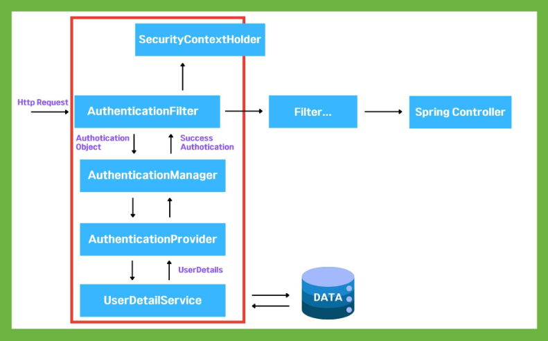
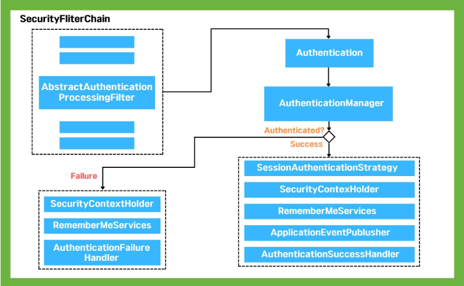

# JWT 로그인, 로그 아웃 구현하기

## Spring Security

**인증, 권한 관리 그리고 데이터 보호 기능**을 포함하여 웹 개발 과정에서 필수적인 사용자 관리 기능을 구현하는데 도움을 주는 Spring의 강력한 프레임 워크

회원가입부터 로그인, 로그아웃, 세션 관리, 권한 관리까지 온라인 플랫폼에 맟춰 다양하게 작업되는 인가&보안 기능은 개발자에게 많은 시간을 요구하는데 Spring Security로 개발자들이 보안 관련 기능을 효율적이고 신속하게 구현할 수 있도록 도와줌

## Spring Security 아키텍처

붉은 색 박스 부분이 Spring Security가 적용되는 부분

과정 간단하게 설명

1. 사용자에게 요청이 서버로 들어옴
2. Authotication Filter가 요청을 가로채고 Authotication Manager로 요청을 위임
3. Authotication Manger로 등록된 Authotication Provider를 조회하며 인증을 요구
4. Authotication Provider가 실제 데이터를 조회하여 UserDetails 결과를 돌려줌
5. 결과 → SecurityContextHolder에 저장되어 유저 정보를 Spring Controller가 사용

## Spring Security가 작동하는 내부 구조

1. 사용자가 자격 정보 제출 → AbstractAuthenticationProcessingFilter가 Authentication 객체를 생성
2. Authentication 객체가 AuthenticationManager에게 전달
3. 인증에 실패하면, 로그인 된 유저 정보가 저장된 SecurityContextHolder의 값이 지워지고 RememberMeService.joinFail()이 실행되고 AuthenticationFailureHandler가 실행
4. 인증에 성공하면, SessionAuthenticationStrategy가 새로운 로그인이 되었음을 알리고, Authentication 이 SecurityContextHolder에 저장. 이후에 SecurityContextPersistenceFilter가 SecurityContext를 HttpSession에 저장하면서 로그인 세션 정보가 저장
5. RememberMeServices.loginSuccess()가 실행. ApplicationEventPublish가 InteractiveAuthenticationSuccessEvent를 발생시키고 AuthenticationSuccessHandler가 실행